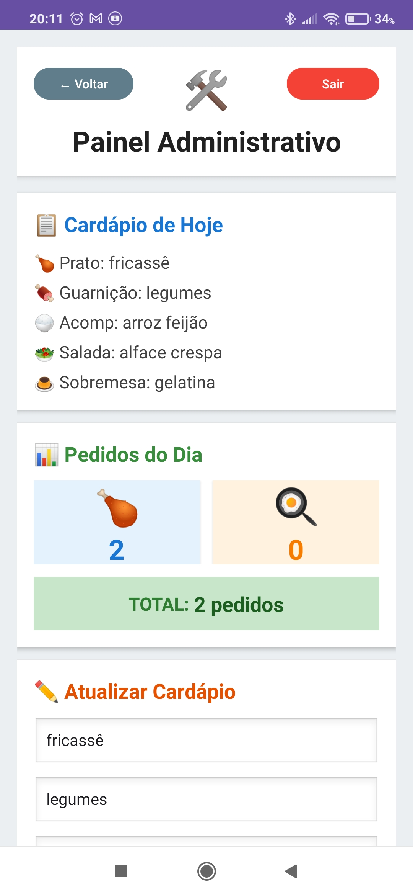
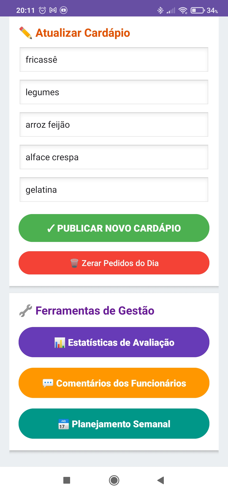
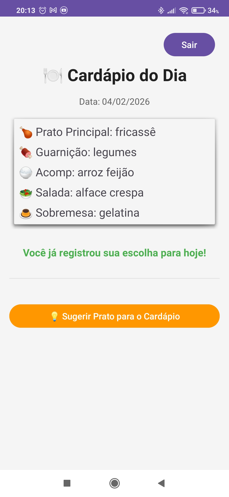

# VisualizadorApp

Aplicativo Android para coleta e análise de feedback de usuários com dashboard administrativo.

## 📱 Sobre o Projeto

Sistema completo de gerenciamento que permite coletar avaliações, visualizar estatísticas em tempo real e gerenciar usuários. Desenvolvido como projeto de portfólio para demonstrar habilidades em desenvolvimento Android nativo.

## 🚀 Funcionalidades

- 🔐 Sistema de autenticação completo (login, cadastro, recuperação de senha)
- 👥 Gerenciamento de usuários com diferentes níveis de acesso
- 📊 Dashboard com gráficos e estatísticas em tempo real
- 💬 Sistema de comentários e feedback
- 📈 Análise de dados com gráficos interativos (Pizza, Barras, Linhas)
- 🔄 Sincronização em tempo real com Firebase
- 🎨 Interface moderna e intuitiva

## 📸 Screenshots

<div align="center">
  
  
  
</div>

## 📋 Pré-requisitos

- Android Studio Arctic Fox ou superior
- JDK 11 ou superior
- Conta no Firebase

## ⚙️ Configuração

### 1. Clone o repositório

```bash
git clone https://github.com/SEU_USUARIO/VisualizadorApp.git
cd VisualizadorApp
```

### 2. Configure o Firebase

1. Crie um projeto no [Firebase Console](https://console.firebase.google.com/)
2. Adicione um aplicativo Android com o package name: `com.example.visualizadorapp`
3. Baixe o arquivo `google-services.json`
4. Coloque o arquivo em `app/google-services.json`

### 3. Configure as variáveis locais

Crie o arquivo `local.properties` na raiz do projeto com o seguinte conteúdo:

```properties
sdk.dir=CAMINHO_DO_SEU_ANDROID_SDK

# Keystore (apenas se for gerar release)
MYAPP_RELEASE_STORE_FILE=app/my-release-key.keystore
MYAPP_RELEASE_STORE_PASSWORD=SUA_SENHA
MYAPP_RELEASE_KEY_ALIAS=SEU_ALIAS
MYAPP_RELEASE_KEY_PASSWORD=SUA_SENHA
```

### 4. (Opcional) Gere sua keystore para releases

```bash
keytool -genkey -v -keystore app/my-release-key.keystore -alias my-key-alias -keyalg RSA -keysize 2048 -validity 10000
```

## 🏗️ Build

### Debug Build
```bash
./gradlew assembleDebug
```

### Release Build
```bash
./gradlew assembleRelease
```

## 📱 Instalação

Após o build, o APK estará em:
- Debug: `app/build/outputs/apk/debug/app-debug.apk`
- Release: `app/build/outputs/apk/release/app-release.apk`

## 🔒 Segurança

**⚠️ IMPORTANTE:** Nunca compartilhe ou faça commit dos seguintes arquivos:
- `google-services.json` - Contém chaves de API do Firebase
- `local.properties` - Contém configurações locais e senhas
- `*.keystore` ou `*.jks` - Arquivos de assinatura do app
- `keystore-info.txt` - Informações de credenciais

Esses arquivos já estão listados no `.gitignore` e não serão incluídos no repositório.

## 📄 Licença

Este projeto está sob a licença MIT. Veja o arquivo LICENSE para mais detalhes.

## 👤 Autor

**Maicon** - Desenvolvedor Android

- GitHub: [@seu-usuario](https://github.com/seu-usuario)
- LinkedIn: [Seu perfil](https://linkedin.com/in/seu-perfil)

---

💡 **Nota:** Este projeto foi desenvolvido como parte do meu portfólio para demonstrar habilidades em:
- Desenvolvimento Android (Java)
- Integração com Firebase (Authentication, Realtime Database)
- Criação de interfaces modernas
- Visualização de dados com gráficos
- Arquitetura de aplicativos Android
